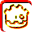
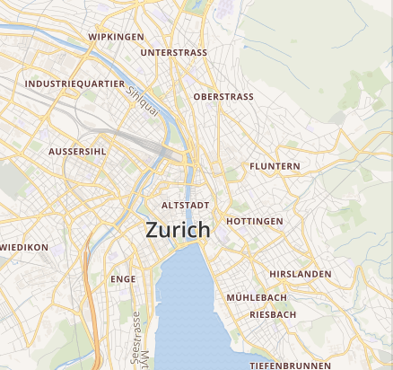
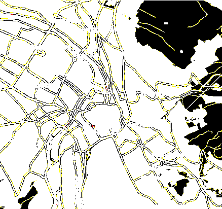
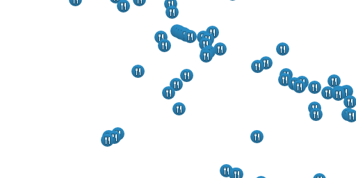
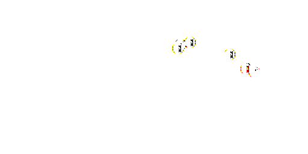
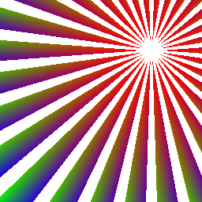
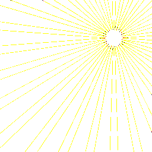

# Godot Pixelmatch


GDScript port of [pixelmatch](https://github.com/mapbox/pixelmatch) the smallest, simplest and fastest JavaScript pixel-level image comparison library,
originally created to compare screenshots in tests.

Still small and simple, but much slower than the original.

Features accurate **anti-aliased pixels detection**
and **perceptual color difference metrics**.

The original project was inspired by [Resemble.js](https://github.com/Huddle/Resemble.js)
and [Blink-diff](https://github.com/yahoo/blink-diff).
Unlike pixelmatch, which works on **raw typed arrays**, this port works on **Images** using `get_pixelv()` and `set_pixelv()`.

```gdscript
const Pixelmatch := preload("res://addons/pixelmatch/pixelmatch.gd")

var matcher := Pixelmatch.new()
matcher.threshold = 0.1
matcher.diff(img1, img2, diff, 800, 600)
```

Implements ideas from the following papers:

- [Measuring perceived color difference using YIQ NTSC transmission color space in mobile applications](http://www.progmat.uaem.mx:8080/artVol2Num2/Articulo3Vol2Num2.pdf) (2010, Yuriy Kotsarenko, Fernando Ramos)
- [Anti-aliased pixel and intensity slope detector](https://www.researchgate.net/publication/234126755_Anti-aliased_Pixel_and_Intensity_Slope_Detector) (2009, Vytautas Vyšniauskas)

## Example output

| expected | actual | diff |
| --- | --- | --- |
|  |  |  |
|  |  |  |
|  |  |  |
|  |  |  |

## API

### diff(img1: Image, img2: Image, output: Image|null, width: int, height: int) -> int

- `img1`, `img2` — Images to compare. **Note:** image dimensions must be equal.
- `output` — Image to write the diff to, or `null` if you don't need a diff image.
- `width`, `height` — Width and height of the images. Note that _all three images_ need to have the same dimensions.

A pixelmatch instance has the following properties:

- `threshold` — Matching threshold, ranges from `0` to `1`. Smaller values make the comparison more sensitive. `0.1` by default.
- `include_aa` — If `true`, disables detecting and ignoring anti-aliased pixels. `false` by default.
- `alpha` — Blending factor of unchanged pixels in the diff output. Ranges from `0` for pure white to `1` for original brightness. `0.1` by default.
- `aa_color` — The color of anti-aliased pixels in the diff output. `Color(255, 255, 0)` by default.
- `diff_color` — The color of differing pixels in the diff output. `Color(255, 0, 0)` by default.
- `diff_color_alt` — An alternative color to use for dark on light differences to differentiate between "added" and "removed" parts. If not provided, all differing pixels use the color specified by `diff_color`. `null` by default.
- `diff_mask` — Draw the diff over a transparent background (a mask), rather than over the original image. Will not draw anti-aliased pixels (if detected).

Compares two images, writes the output diff and returns the number of mismatched pixels. Returns -1 if there was an error.

## Example usage

```gdscript
extends Node

const Pixelmatch = preload("res://addons/pixelmatch/pixelmatch.gd")


func _ready():
	var img1: Image = load("res://img1.png").get_data()
	var img2: Image = load("res://img2.png").get_data()
	var width: int = img1.get_width()
	var height: int = img2.get_height()

	var diff := Image.new()
	diff.create(width, height, false, Image.FORMAT_RGBA8)

	var matcher = Pixelmatch.new()
	matcher.threshold = 0.1
	matcher.diff(img1, img2, diff, width, height)

	diff.save_png("res://diff.png")
```

See the [test.gd](/test/test.gd) file for more usage examples.

## Install

Install from the asset library:
<https://godotengine.org/asset-library/asset/996>.

Or install with [gd-plug](https://github.com/imjp94/gd-plug):

```gdscript
# plug.gd
func _plugging():
	plug("lihop/godot-pixelmatch")
```

```bash
godot --no-window -s plug.gd install
```


## Testing

If you want to run the tests locally you will need to install the WAT and/or Gut addons.
This can be done through the asset-lib or by using gd-plug.

```bash
godot --no-window -s plug.gd install

```

## [Changelog](https://github.com/lihop/pixelmatch/releases)
